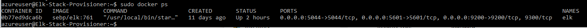

# Elk-Stack-Project
Creating Azure cloud environment, working with VNet, VM, Container machines, configuring firewall
## Automated ELK Stack Deployment

The files in this repository were used to configure the network depicted below.

(Images/Cloud_Security_Network.png)

These files have been tested and used to generate a live ELK deployment on Azure. They can be used to either recreate the entire deployment pictured above. Alternatively, select portions of the __Filebeat-config.yml__ file may be used to install only certain pieces of it, such as Filebeat.

This document contains the following details:
- Description of the Topology
- Access Policies
- ELK Configuration
  - Beats in Use
  - Machines Being Monitored
- How to Use the Ansible Build

### Description of the Topology

The main purpose of this network is to expose a load-balanced and monitored instance of DVWA, the D*mn Vulnerable Web Application.

Load balancing ensures that the application will be highly available, in addition to restricting all unwanted access to the network from different ports.

Integrating an ELK server allows users to easily monitor the vulnerable VMs for changes to the specific file systems and system metrics or health.

The configuration details of each machine may be found below.

| Name     | Function | IP Address | Operating System |
|----------|----------|------------|------------------|
| Jump Box | Gateway  | 10.0.0.4   | Linux            |
| Web 1 DVWA Container    | Web Server   | 10.0.0.5   | Linux            |
| Web 2 DVWA Container    | Web Server   | 10.0.0.6   | Linux            |
| Web 3 DVWA Container    | Web Server   | 10.0.0.7   | Linux            |
| Elk  |  Monitors  vulnerabilities  | 10.1.0.4   | Linux            |

### Access Policies

The machines on the internal network are not exposed to the public Internet. 

Only the Jump Box machine can accept connections from the Internet. Access to this machine is only allowed from the following IP address: 20.118.202.238 

Machines within the network can only be accessed by Jump Box (20.118.202.238).

A summary of the access policies in place can be found in the table below.

| Name     | Publicly Accessible | Allowed IP Addresses |
|----------|---------------------|----------------------|
| Jump Box | Yes              |   20.118.202.238   |
| ELK         |     No               |     20.124.6.225                 |
|  Web 1 DVWA Container        |     No                |   10.0.0.5                   |
|  Web 2 DVWA Container        |     No                |   10.0.0.6                   |
|  Web 3 DVWA Container        |     No                |   10.0.0.7                   |

### Elk Configuration

Ansible was used to automate configuration of the ELK machine. No configuration was performed manually, which is advantageous because you save time, effort and reduce the instances of mistakes. 

The playbook implements the following tasks:
- Configure Elk VM with Docker and install Docker engine to run containers
- Install Python software
- Install Docker Module
- Increase VM memory
- Launch docker elk container

The following screenshot displays the result of running `docker ps` after successfully configuring the ELK instance.

### Target Machines & Beats
This ELK server is configured to monitor the following machines:
- 10.0.0.5
- 10.0.0.6
- 10.0.0.7

We have installed the following Beats on these machines:
- Filebeat
- Metricbeat

These Beats allow us to collect the following information from each machine:
- Filebeat : Collects data about the file system such as log data
- Metricbeat : Collects metrics about the machine that tells how healthy it is, such as uptime which is basically how long a machine has been on, and CPU usage which basically means the heavier the load on a machine, the more likely it is to fail.

### Using the Playbook
In order to use the playbook, you will need to have an Ansible control node already configured. Assuming you have such a control node provisioned: 

SSH into the control node and follow the steps below:
- Copy the configuration file _install-elk.yml_ to the _Ansible Container_.
- Update the _hosts_ file to include the following groups (specify groups by using brackets):

[webservers]
 10.0.0.4 ansible_python_interpreter=/usr/bin/python3
 10.0.0.5 ansible_python_interpreter=/usr/bin/python3
 10.0.0.6 ansible_python_interpreter=/usr/bin/python3

 [elk]
 10.1.0.4 ansible_python_interpreter=/usr/bin/python3

- Run the playbook, and navigate to _http://[your.VM.IP]:5601/app/kibana_ to check that the installation worked as expected.

Follow these instructions in order to run, download the playbook, update the files, etc...
Begin with __nano /etc/ansible/hosts__ to edit the host file and add elk group and IP address as shown above. 
You can create a YAML playbook file by running __touch /etc/ansible/install-elk.yml__ or simply copy the install-elk yaml file from the ansible folder and run __ansible-playbook install-elk.yml__
This will take some time to load and will display each task Ansible has completed
